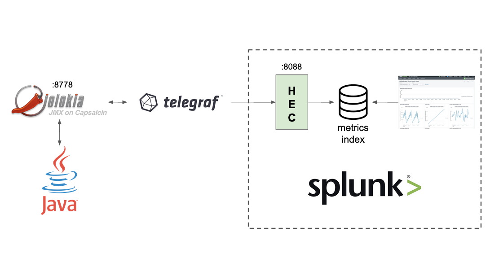
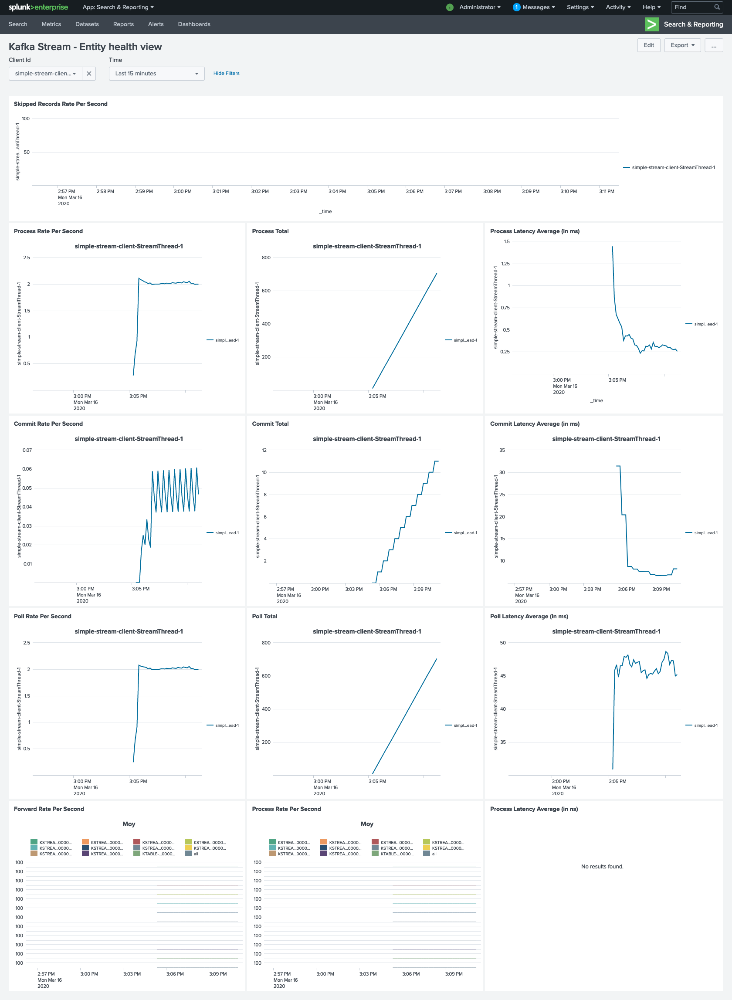

# Kafka Application Monitoring Splunk
Simple demo of how to monitor a Kafka application with [Splunk](https://www.splunk.com/) .

# Prerequisites
You need to have docker and docker-compose installed.

# Getting started
## Start the environment 
To start the environment simply run the following command
```
docker-compose up -d
```
Go to http://localhost:8000/en-US/app/search/telegraf-kafka-kafka-stream (Splunk). Login/password is admin/changeme.

## Build local images
This repository contains some local docker images including :
* jolokia
*  a simple application (producer/stream/consumer)
To build all images you just need to run :
```
docker-compose build
```

# Destroy the environment
To destroy the environment simply run the following command to destroy containers and associated volumes :
```
docker-compose down -v
```

# Architecture



Kafka client expose their metrics via [JMX](https://en.wikipedia.org/wiki/Java_Management_Extensions) Mbeans, since JMX is always tricky to access, we use [Jolokia](https://jolokia.org) as a JVM agent.
Jolokia proposes an HTTP endpoint which receive metric queries and will respond with the current JMX MBean values.

On the other hand, Splunk proposes a Http Event Collector (aka. HEC) data input which permits to send securely events or metrics over HTTP via a token. In our current setup, we define an endpoint and configure it to persist the data into a metric index (rather than event) to build awesome dashboards.

We use [Telegraf](https://www.influxdata.com/time-series-platform/telegraf/) as go between the applicaton and Splunk. We define in the  file the JMX metrics we want to collect (see the `inputs.jolokia2_agent.metric` sections) and the target HEC ouput (see the `outputs.http` section).


More info: https://www.splunk.com/en_us/blog/it/splunk-metrics-via-telegraf.html

# Sample Application
Note: To ease the development, you can use the `kafka_cluster.yml` docker-compose file which provide a Kafka Broker and a Zookeeper:
```
docker-compose -f kafka_cluster.yml up -d
```

The `sample-application` is a dummy Java 11 application composed by:

## SimpleProducer
Simulates a factory. It sends a production event every second into a `production` topic.
The production event structure:
* key: `ItemType#<Number>`: represent an item model/type.
* value: `Machine#<Number>|Item#<UUID>`: represent a fabrication of a unique Item on a Machine

## SimpleStream
A Kafka stream aggregating the production event per minute and counting the number of events per machine.
The result is materialized into KTable named `machine-1m-count-store` and each state change are propagated to a `machine-1m-production-performance`.
The topology description:
```
Sub-topology: 0
    Source: KSTREAM-SOURCE-0000000000 (topics: [production])
      --> KSTREAM-PEEK-0000000001
    Processor: KSTREAM-PEEK-0000000001 (stores: [])
      --> KSTREAM-KEY-SELECT-0000000002
      <-- KSTREAM-SOURCE-0000000000
    Processor: KSTREAM-KEY-SELECT-0000000002 (stores: [])
      --> KSTREAM-FILTER-0000000005
      <-- KSTREAM-PEEK-0000000001
    Processor: KSTREAM-FILTER-0000000005 (stores: [])
      --> KSTREAM-SINK-0000000004
      <-- KSTREAM-KEY-SELECT-0000000002
    Sink: KSTREAM-SINK-0000000004 (topic: machine-1m-count-store-repartition)
      <-- KSTREAM-FILTER-0000000005

  Sub-topology: 1
    Source: KSTREAM-SOURCE-0000000006 (topics: [machine-1m-count-store-repartition])
      --> KSTREAM-AGGREGATE-0000000003
    Processor: KSTREAM-AGGREGATE-0000000003 (stores: [machine-1m-count-store])
      --> KTABLE-TOSTREAM-0000000007
      <-- KSTREAM-SOURCE-0000000006
    Processor: KTABLE-TOSTREAM-0000000007 (stores: [])
      --> KSTREAM-MAP-0000000008
      <-- KSTREAM-AGGREGATE-0000000003
    Processor: KSTREAM-MAP-0000000008 (stores: [])
      --> KSTREAM-PEEK-0000000009
      <-- KTABLE-TOSTREAM-0000000007
    Processor: KSTREAM-PEEK-0000000009 (stores: [])
      --> KSTREAM-SINK-0000000010
      <-- KSTREAM-MAP-0000000008
    Sink: KSTREAM-SINK-0000000010 (topic: machine-1m-production-performance)
      <-- KSTREAM-PEEK-0000000009
```

Note: To access to all Kafka Metrics, you may need to change the `metrics.recording.level` from `INFO` to `DEBUG`.

## SimpleConsumer
A dummy consumer logging the details of every new record coming from `machine-1m-production-performance`.

# Dashboards
## Kafka Stream


# Credits
Based on [Sylvain Le Gouellec](https://github.com/LGouellec) work.
